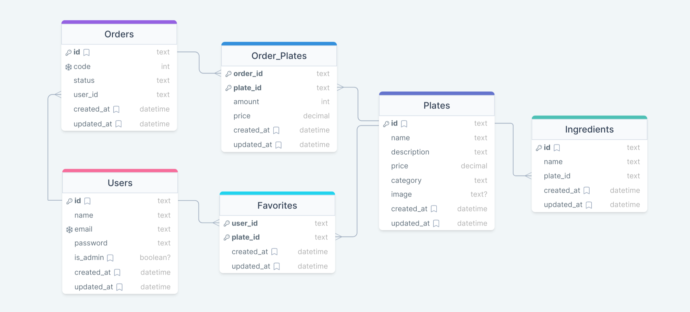

# Food Explorer API

## Entity Relationship Diagram


## Technologies
- `Node.js`
- `Typescript`
- `Express`
- `JSON Web Token (JWT)`
- `Prisma`
- `Bcrypt`
- `Multer`

## Installation

```bash
# Clone project
$ git clone https://github.com/EmanuelQuintino/Food-Explorer-API.git

# Install dependencies
$ npm install

# Install Prisma Client
$ npm install @prisma/client

# Run Prisma Migrations
$ npx prisma migrate dev

# Run Prisma Seeds
$ npx prisma db seed

# Run API
$ npm run dev
```
## Attention

#### Fill it up Environment Variables

```ini
DATABASE_URL=""
SECRET_TOKEN=""
EXPIRESIN_TOKEN=""
ADMIN_EMAIL=""
ADMIN_PASSWORD=""
```

## Links

- [Deploy](https://project-food-explorer.netlify.app/)
- [Client-Side Repository](https://github.com/EmanuelQuintino/Food-Explorer)
